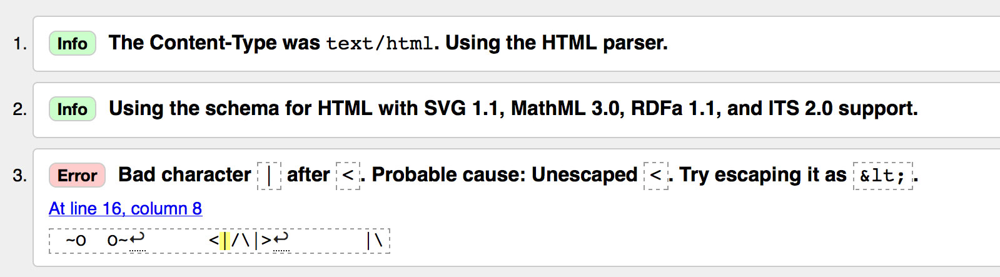

# Validating your HTML

Before we begin making changes to the HTML file, we need to ensure our code *validates*. There's a service we can use to help catch structural problems in our HTML.

## Edit the HTML file

* Open the Atom editor
* Close any existing windows
* Open your new project directory, `project-1-duel`

You should see your files in the project sidebar.

## Open duel.html

* Click on __duel.html__ from the project sidebar
* Select all the text from the file and __copy__ it to your clipboard

## Markup Validator Service

* Go to the [W3C Validator](https://validator.w3.org/)
* Click on the third tab, __Validate by Direct Input__
* __Paste__ your HTML text into the input
* Click the __Check__ button

## Understanding the validation results

If you scroll down to see your validation results, you'll see two kinds of feedback. The green __info__ messages are nothing to be concerned about. The red __error__ messages are things we should fix (but also nothing to be *too* concerned about).



You will probably see three errors about "Bad character | after &lt;". You may see more errors depending on your HTML, but I would expect you to get at *least* three errors.

What those errors are saying is "&lt;" and "&gt;" are how we designate *tags* and you've gone and used them for ASCII arms. The answer to this is *escaping*, much like JavaScript escaping of strings, described in this week's reading.

* Go back to Atom editor
* Replace each instance of a "&lt;" in your ASCII art with "&amp;lt;" (lt stands for *less than*)
* Do the same for "&gt;", replace those with "&amp;gt;" (gt stands for *greater than*)

Now your first duel frame should look like this:

```
~O  O~
&lt;|/\|&gt;
 |\ |\
```
 
 * Save your changes, and then copy/paste the new HTML into the Validator
 * Click the __Check__ button again
 
If all goes well, you should get a new green message that says "Document checking completed. No errors or warnings to show." Nicely done! We are going to try keeping our HTML validating from now on.

If you have additional errors, see if you can make sense of the Validator's suggestions. IF you can't figure it out, try searching for the error message since others may have also had this problem. You can also just email me if you get stuck.

[Setting up the CSS &rarr;](setup-css){.button}

## Previously

* [Setting up your repository](repo)
