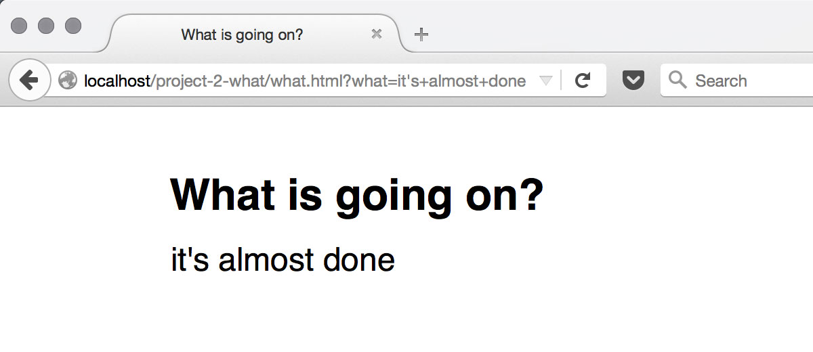

# Form data

Next we'll parse the data from the URL query string using JavaScript, and assign the data to the `<textarea>`.

## Get the raw query string

* Add the following to `what.js`.

```js
var what = location.search;
console.log(what);
```

Reload `what.html` in your web browser, type in "hello world" as a test input, and check the JavaScript console (⌘-opt-J). You should see `?what=hello+world` logged in the console.

## Parsing the data

There are a few things we need to do to make the text appear the same way it was typed in. Our goal will be to make this page *linkable*, but with minimal interruption as people type things in.

* Let's get rid of the `?what=` part. Add the following *just* before the `console.log` from earlier.

```js
what = what.replace('?what=', '');
```

If you reload the page, you should see `hello+world` logged to console. The plus sign is from how forms encode spaces in the query string. We just need to decode it.

* Let's replace all those `+` symbols with spaces with this global [regular expression](http://www.regular-expressions.info/javascript.html). Again, let's add the following just before the `console.log` command.

```js
what = what.replace(/\+/g, ' ');
```

Reloading the page should now yield `hello world` in the JavaScript console as expected. However, if we try a different text input, for example "it's almost done", you will see something slightly weird logged to the JavaScript console, `it%27s almost done`.

* Add one more text parsing rule before your `console.log` command to decode the query string.

```js
what = decodeURIComponent(what);
```

Now the string that gets logged should be the same as what you typed in: `it's almost done`.

## Assign a new value to the `<textarea>`

Now we can take the string variable `what` and assign it to be the new value of the  `<textarea>` when the page loads.

* Replace the `console.log` command with the following.

```js
textarea.value = what;
```

Now if you reload the page, type in a new test phrase into the input, and then click away you should see a brief flash while the page reloads, but the original string should reappear in the `<textarea>`.

{.border}

[Continue](own-it){.button}
