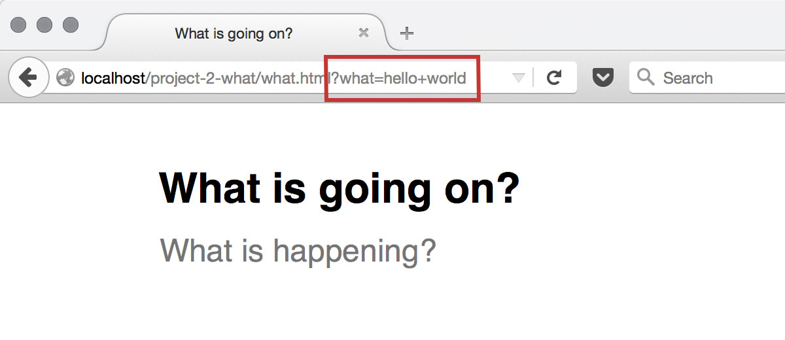

# Form submission

It is finally time for us to start writing JavaScript!

## Set up variables

The first step will be to set up some variables that we can use to access the form data.

* Open `what.js` in your editor.
* Add the following variable assignments to the top of the file.

```js
var textarea = document.getElementById('what');
var form = document.getElementsByTagName('form')[0];
```

## Event handler

Next we'll add an event handler that automatically submits the form as soon as the content of the `<textarea>` changes.

* Add the following to your JavaScript.

```js
textarea.addEventListener('change', function() {
	form.submit();
}, false);
```

## Test it out

Make sure all your changes are saved and then open `what.html` in your browser. When you type in a test phrase, and then click away, you should see the page redirect to a URL that includes the text you typed in.

{.border}

However, you'll notice the text you type in disappears right after you finish. We'll fix this in the next step.

{.border}

[Continue](form-data){.button}
