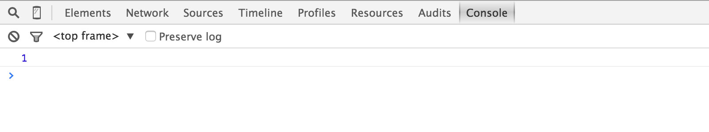
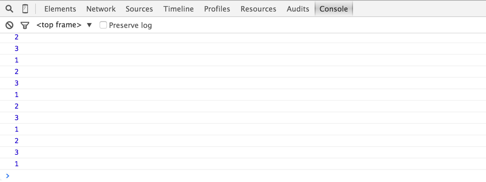

# Cycling through the frames

We are ready to add our first JavaScript to the page! We're going to use *variables* and a *interval* to make our ASCII duel animate.

## Setup your variable

We're going to add our JavaScript near the end of your HTML file, right before the `</body>` close tag.

* Add the following `<script>` element to your HTML

```html
  <script>
  
  var frame = 1;
  console.log(frame);
  
  </script>
</body>
```

* Load your page in Google Chrome (use File &rarr; Open File)

You should see just the first animation frame. If you open the JavaScript console (⌘-opt-J) you should also see the number `1` logged.

{.border}

## Setup your interval

* Replace the `console.log(frame)` with the following JavaScript interval

```js
setInterval(function() {
  console.log(frame);
}, 1000);
```

If you reload your page in Chrome, you should now see a series of `1`'s logged to the JavaScript console.

* Add one more line inside the interval to increment the frame number once per second

```js
setInterval(function() {
  console.log(frame);
  frame = frame + 1;
}, 1000);
```

Now you should see a series of incrementing numbers logged to the JavaScript console.

* Add a *conditional* `if` statement to reset the count

```js
setInterval(function() {
  console.log(frame);
  frame = frame + 1;
  if (frame == 4) {
    frame = 1;
  }
}, 1000);
```

Now you should see a cycle: `1`, `2`, `3`, `1`, `2`, `3`, etc.

{.border}

## Cycling the frame

Now we're ready to apply our cycling frame number to choose each ASCII duel frame.

* Add the following *before* the `frame = frame + 1`

```js
var el = document.getElementById('duel' + frame);
el.className = '';
```

* Next, add the following *just after* `if` statement's closing `}`

```js
el = document.getElementById('duel' + frame);
el.className = 'visible';
```

If you reload the page, you should now see your cycling duel animation. Hooray!

[Make it your own &rarr;](own-it){.button}

## Previously

* [Setting up the CSS](setup-css)
