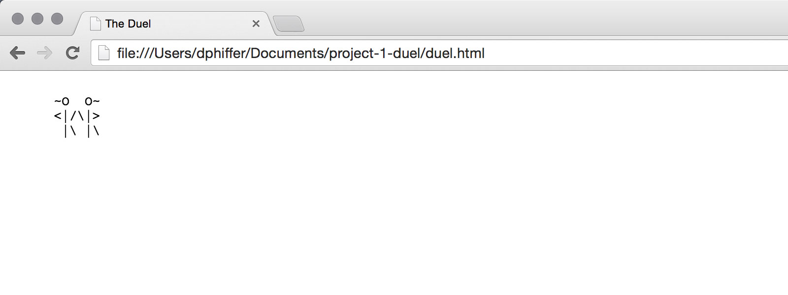

# Setting up the CSS

We'll start by creating some CSS styles for our ASCII animation.

## Add some new CSS rules

* Open the file `duel.html`
* Add a __display: none__ CSS property inside the `<style>` element to hide all the DIVs by default

```css
div {
  display: none;
  white-space: pre;
  font-family: monospace;
}
```

* Add a new CSS selector block to show *just* the frame with the `visible` class

```css
.visible {
  display: block;
}
```

## Add the HTML class

Add a `visible` class *just* to the first duel DIV. Don't modify the other 2 DIVs, we want them to be hidden.

```html
<div id="duel1" class="visible">
  ~O  O~
  &lt;|/\|&gt;
   |\ |\
</div>
```

If you open your file in Google Chrome (File &rarr; Open File), you should just see a single frame instead of three.

{.border}

[Cycling through the frames &rarr;](cycling){.button}

## Previously

* [Validating your HTML](validate)
