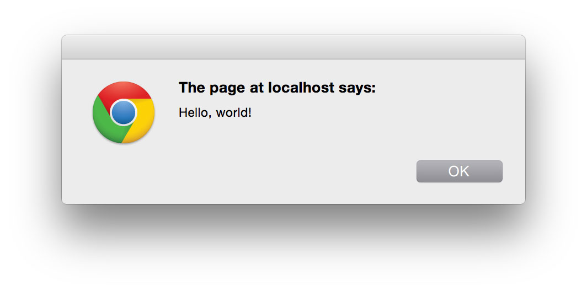
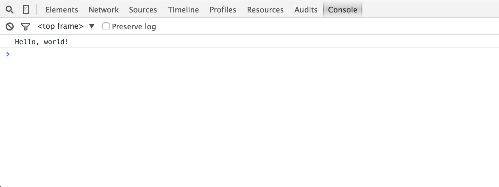
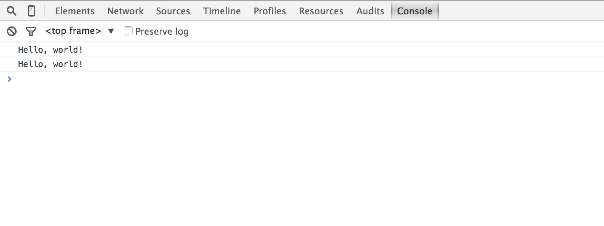
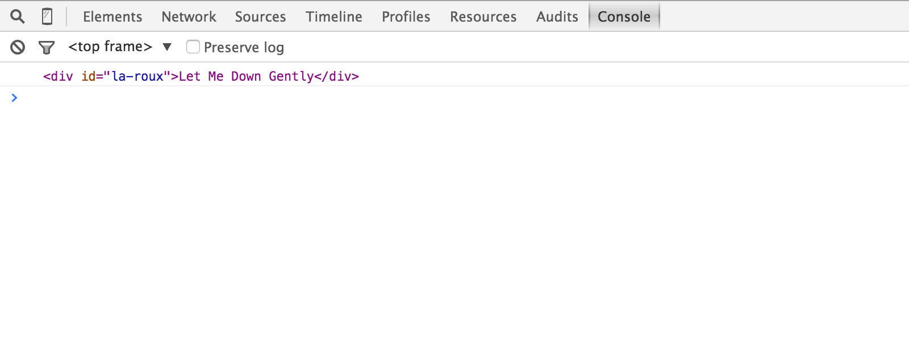
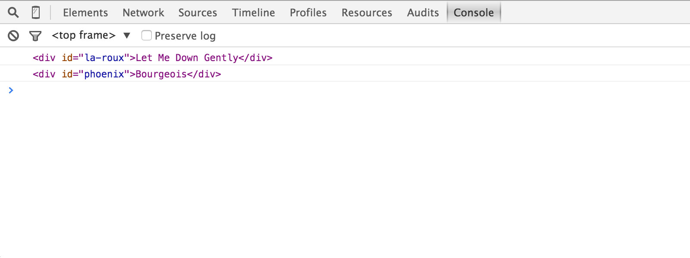
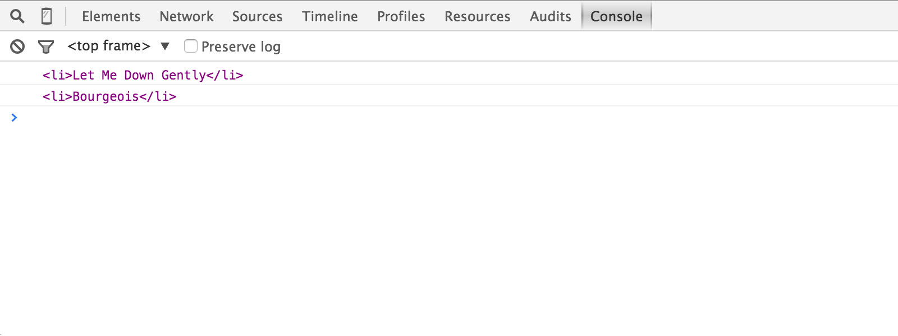
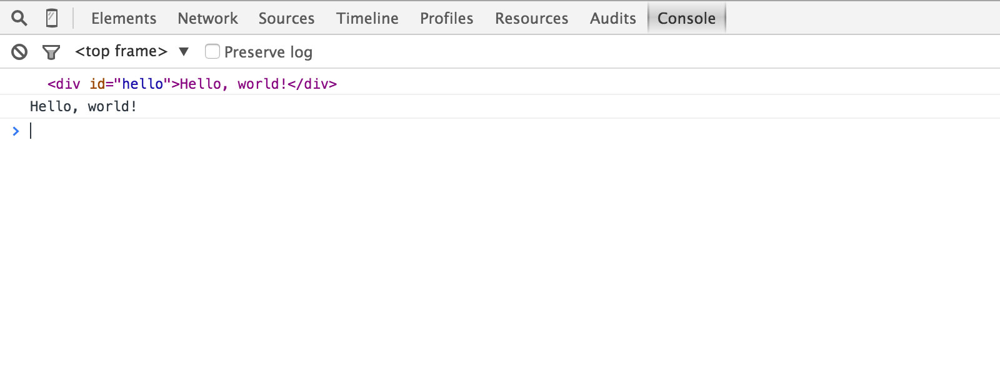
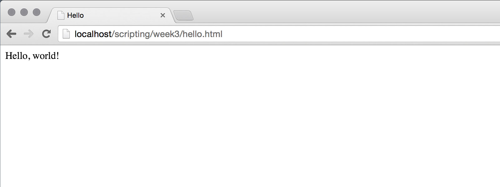
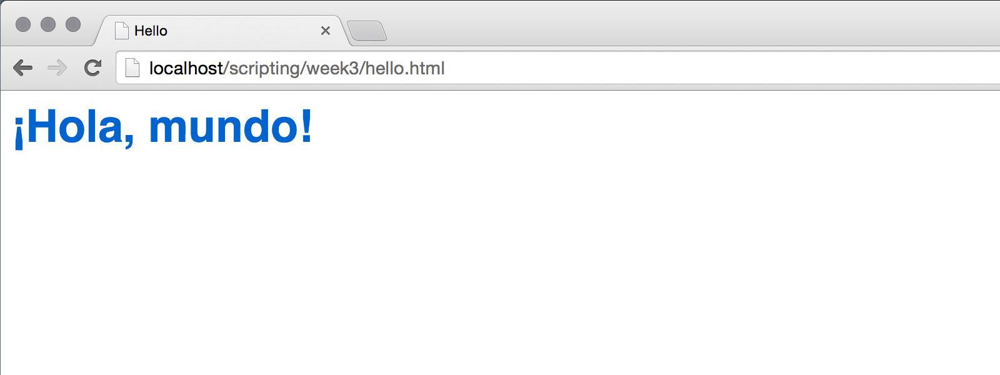

<!--

template: slideshow.php

-->

class: center, middle

# Intro to JavaScript + DOM

---

layout: true

### Hello, JavaScript

---

```html
<script>
// The generic first example
alert('Hello, world!');
</script>
```

--



---

```html
<script>
// A slightly quieter second example
//   In Google Chrome: View &rarr; Developer &rarr; JavaScript Console (⌘-opt-J)
console.log('Hello, world!');
</script>
```

--

.border[]

---

```html
<script>
// Now, with a variable
var message = 'Hello, world!';
console.log(message);
</script>
```

.border[]

---

```html
<script>
// Now, with *two* variables
var firstPart = 'Hello,';
var secondPart = " world!";
console.log(firstPart + secondPart);
</script>
```

.border[]

---

```html
<script>
// This time with an array
var messageParts = ['Hello, ', 'world!'];
console.log(messageParts[0] + messageParts[1]);
</script>
```

.border[]

---

```html
<script>
// Let's try it with an object, why not?
var messageLookup = {
  hello: 'Hello, ',
  world: 'world!'
};
console.log(messageLookup.hello + messageLookup.world);
</script>
```

.border[]

---

```html
<script>
// Objects let you access their properties two different ways
var messageLookup = {
  hello: 'Hello, ',
  world: 'world!'
};
console.log(messageLookup.hello + messageLookup.world);
console.log(messageLookup['hello'] + messageLookup['world']);
</script>
```

.border[]

---

layout: false

# Document Object Model

* A standard API for inspecting + modifying the page
* Finding a single element
* Finding multiple elements
* Changing an element’s content dynamically
* Changing an element’s style dynamically

---

# getElementById

```html
<div id="la-roux">Let Me Down Gently</div>
<script>
var element = document.getElementById('la-roux');
console.log(element);
</script>
```

--

.border[]

---

# getElementsByTagName

```html
<div id="la-roux">Let Me Down Gently</div>
<div id="phoenix">Bourgeois</div>
<script>
var elements = document.getElementsByTagName('div');
console.log(elements[0]);
console.log(elements[1]);
</script>
```

.border[]

---

# getElementsByClassName

```html
<div id="la-roux" class="music">Let Me Down Gently</div>
<div id="phoenix" class="music">Bourgeois</div>
<script>
var elements = document.getElementsByClassName('music');
console.log(elements[0]);
console.log(elements[1]);
</script>
```

.border[]

---

# querySelector

```html
<div id="la-roux" class="music">Let Me Down Gently</div>
<div id="phoenix" class="music">Bourgeois</div>
<script>
var firstSong  = document.querySelector('#la-roux');
var secondSong = document.querySelector('div[id=phoenix]');
console.log(firstSong);
console.log(secondSong);
</script>
```

.border[]

---

# querySelectorAll

```html
<ol id="music">
  <li>Let Me Down Gently</li>
  <li>Bourgeois</li>
</ol>
<script>
var songs = document.querySelectorAll('#music li');
console.log(songs[0]);
console.log(songs[1]);
</script>
```

.border[]

---

# Querying nodes

```html
<ol id="music">
  <li>Let Me Down Gently</li>
  <li>Bourgeois</li>
</ol>
<script>
// querySelectorAll is more compact...
var songs = document.querySelectorAll('#music li');

// ...but we could do this another way in two steps
var songList  = document.getElementById('music');
var songItems = songList.getElementsByTagName('li');
</script>
```

---

# innerHTML

```html
<div id="hello">Hello, world!</div>
<script>
var hello = document.getElementById('hello');
console.log(hello);
console.log(hello.innerHTML);
</script>
```

--

.border[]

---

# innerHTML

```html
<div id="hello">Hello, world!</div>
<script>
var hello = document.getElementById('hello');
console.log(hello);
console.log(hello.innerHTML);
</script>
```



---

# Modifying content

```html
<div id="hello">Hello, world!</div>
<script>
var hello = document.getElementById('hello');
// We can also assign a value to innerHTML
hello.innerHTML = '¡Hola, mundo!';
</script>
```


---

# Modifying styles

```html
<div id="hello">Hello, world!</div>
<script>
var hello = document.getElementById('hello');
hello.innerHTML = '¡Hola, mundo!'; // We can modify both HTML
hello.style.fontWeight = 'bold';   // and CSS!
hello.style.fontSize   = '36px';
hello.style.fontFamily = 'helvetica, sans-serif';
hello.style.color      = '#390';
</script>
```



---

# setTimeout

* Lets you pause before your code runs
* Time is measured in milliseconds

```html
<div id="hello">Hello, world!</div>
<script>
var delay = 3000; // 3 seconds
setTimeout(function() {
  // This won't run immediately...
  var hello = document.getElementById('hello');
  hello.innerHTML = '¡Hola, mundo!';
}, delay);
</script>
```

---

# setInterval

* Like `setTimeout`, but it keeps repeating

```js
<div id="count">0</div>
<script>
var delay = 1000;
var count = 1;
setInterval(function() {
  // Update the count <div>
  var el = document.getElementById('count');
  el.innerHTML = count;
  
  // Increment count by 1
  count = count + 1;
}, delay);
</script>
```

---

# Next time

* CSS Positioning
