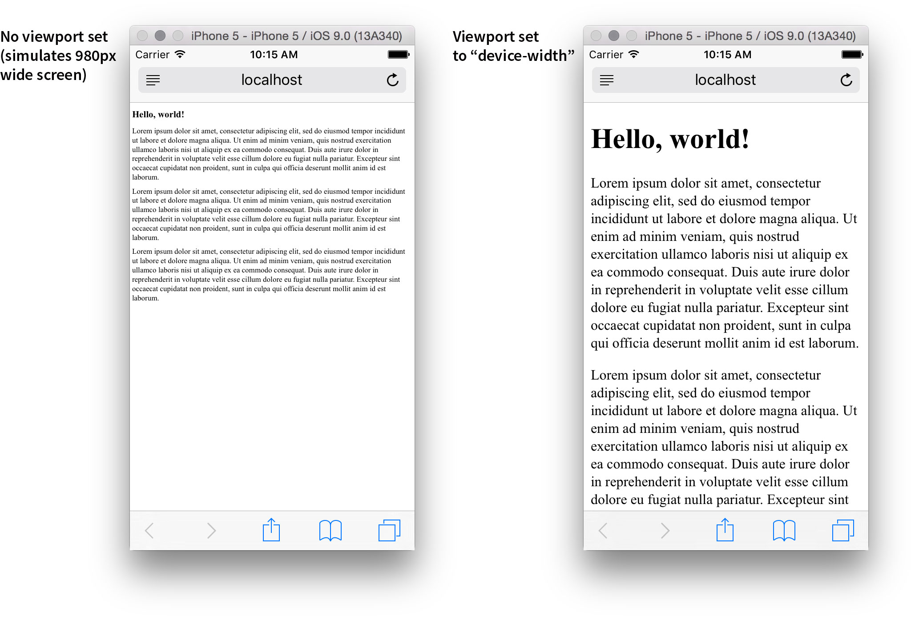

<!--

template: slideshow.php

-->

class: center, middle

# CSS Positioning (part 1)

---

### Quick recap

* CSS Selectors
* CSS Properties
* Box model

---

layout: true

### Quick recap
# CSS Selectors

---

* Which part of the page gets styled for a given CSS block
* They *select* which HTML we’re interested in

```css
[selector] {
	[properties]
}
```

---

```css
#foo {
	[properties]
}
```

__Matches__

```html
<div id="foo">
	This box can be styled with pound-foo.
	The ID implies there’s just one of me called “foo.”
</div>
```

---

```css
.bar {
	[properties]
}
```

__Matches__

```html
<div class="bar">
	This box can be styled using dot-bar.
</div>
<div class="bar">
	So can this one. Classes are for multiples.
</div>
```

---

```css
#foo .bar {
	[properties]
}
```

__Matches__

```html
<div id="foo">
	<div class="bar">
		This box is matched by “#foo .bar.”
	</div>
</div>
<div class="bar">
	This one isn’t, since it doesn’t have a parent called #foo.
</div>
```

---

layout: true

### Quick recap
# CSS Properties

---

* Adjust the matched elements in a particular way
* Each property has a name/value pair, separated by `:`
* Each property is terminated by `;`

```css
[selector] {
	[name]: [value];
}
```

---

__CSS__

```css
#foo {
	background: yellow;
}
```

__HTML__

```html
<div id="foo">
	I have a yellow background.
</div>
```

---

__CSS__

```css
#foo {
	background: yellow;
	font-weight: bold;
}
```

__HTML__

```html
<div id="foo">
	I have a yellow background.
	And my text is bold.
</div>
```

---

__CSS__

```css
#foo {
	background: yellow;
	font-weight: bold;
	width: 50px;
}
```

__HTML__

```html
<div id="foo">
	I have a yellow background.
	And my text is bold.
	And I am not very wide.
</div>
```

---

layout: true

### Box model

---

```
+-------------------------------------+
|               margin                |
|   +-----------------------------+   |
|   |           border            |   |
|   |   +---------------------+   |   |
|   |   |       padding       |   |   |
|   |   |   +-------------+   |   |   |
|   |   |   |             |   |   |   |
|   |   |   |   content   |   |   |   |
|   |   |   |             |   |   |   |
|   |   |   +-------------+   |   |   |
|   |   |                     |   |   |
|   |   +---------------------+   |   |
|   |                             |   |
|   +-----------------------------+   |
|                                     |
+-------------------------------------+

```

---

```
+-------------------------------------+
|               margin                |   .box {    
|   +-----------------------------+   |       width: 70px;
|   |           border            |   |       padding: 10px;
|   |   +---------------------+   |   |       border: 5px solid #ccc;
|   |   |       padding       |   |   |       margin: 15px;
|   |   |   +-------------+   |   |   |   }
|   |   |   |             |   |   |   |
|   |   |   |   content   |   |   |   |
|   |   |   |             |   |   |   |
|   |   |   +-------------+   |   |   |
|   |   |                     |   |   |
|   |   +---------------------+   |   |
|   |                             |   |
|   +-----------------------------+   |
|                                     |
+-------------------------------------+

```

<div class="box-model-example">
  <div class="box">lorem</div>
  <div class="box">ipsum</div>
</div>

---

```
+-------------------------------------+   
|               margin                |   By default, setting the 'width'
|   +-----------------------------+   |   defines the width of the content box.
|   |           border            |   |
|   |   +---------------------+   |   |   .box {
|   |   |       padding       |   |   |       width: 70px;
|   |   |   +-------------+   |   |   |       padding: 10px;
|   |   |   |             |   |   |   |       border: 5px solid #ccc;
|   |   |   |   content   |   |   |   |       margin: 15px;
|   |   |   |             |   |   |   |   }
|   |   |   +-------------+   |   |   |
|   |   |                     |   |   |           Content:  70px
|   |   +---------------------+   |   |           Padding:  20px
|   |                             |   |   +        Border:  10px
|   +-----------------------------+   |   ----------------------
|                                     |       Visible box: 100px
+-------------------------------------+
    |       |<   width   >|       |
    |                             |
    |<        visible box        >|
```

---

```
+-------------------------------------+   
|               margin                |   With 'box-sizing: border-box', the
|   +-----------------------------+   |   'width' sets the visible box's width.
|   |           border            |   |
|   |   +---------------------+   |   |   .box {
|   |   |       padding       |   |   |       box-sizing: border-box;
|   |   |   +-------------+   |   |   |       width: 100px;
|   |   |   |             |   |   |   |       padding: 10px;
|   |   |   |   content   |   |   |   |       border: 5px solid #ccc;
|   |   |   |             |   |   |   |       margin: 25px;
|   |   |   +-------------+   |   |   |   }
|   |   |                     |   |   |   
|   |   +---------------------+   |   |   Our box will look exactly the same,
|   |                             |   |   100px wide, but now the width property
|   +-----------------------------+   |   intuitively makes sense.
|                                     |
+-------------------------------------+
    |<           width           >|
    |                             |
    |<        visible box        >|
```

---

layout: false

# Content box

* Consider the following CSS
* The padding isn’t included in the `100%`

```css
#content {
	width: 100%;
	padding: 25px;
}
```

--

<div class="box-sizing-example">
	<div class="content">
		Lorem ipsum dolor sit amet, consectetur adipiscing elit, sed do eiusmod tempor incididunt ut labore et dolore magna aliqua. Ut enim ad minim veniam, quis nostrud exercitation ullamco laboris nisi ut aliquip ex ea commodo consequat. Duis aute irure dolor in reprehenderit in voluptate velit esse cillum dolore eu fugiat nulla pariatur. Excepteur sint occaecat cupidatat non proident, sunt in culpa qui officia deserunt mollit anim id est laborum.
	</div>
</div>

---

# Border box

* What we want is for the *total* area to be `100%`
* `border-box` fixes this for us

```css
#content {
	box-sizing: border-box;
	width: 100%;
	padding: 25px;
}
```

--

<div class="box-sizing-example border-box-example">
	<div class="content">
		Lorem ipsum dolor sit amet, consectetur adipiscing elit, sed do eiusmod tempor incididunt ut labore et dolore magna aliqua. Ut enim ad minim veniam, quis nostrud exercitation ullamco laboris nisi ut aliquip ex ea commodo consequat. Duis aute irure dolor in reprehenderit in voluptate velit esse cillum dolore eu fugiat nulla pariatur. Excepteur sint occaecat cupidatat non proident, sunt in culpa qui officia deserunt mollit anim id est laborum.
	</div>
</div>

---

# Border box

* `box-sizing: border-box` makes your life easier
* Add this to your CSS to make it the default

```css
html {
  box-sizing: border-box;
}

*, *:before, *:after {
  box-sizing: inherit;
}
```

.footnote[Credit: [Paul Irish](http://www.paulirish.com/2012/box-sizing-border-box-ftw/)]

---

# Viewport

* Mobile browsers have a “zoomed” view of the page
* The viewport setting defines *how much* zoom
* A `<meta>` tag in the `<head>` of the page

```html
<head>
	<meta charset="utf-8">
	<meta name="viewport" content="width=device-width">
	<title>Hello, world!</title>
</head>
```

---

# Viewport sets the zoom



---

# Media queries

* Apply CSS depending on screen size (and other factors)
* Used to create “responsive designs”
* The layout *responds to* the width of the browser

```css

#page {
	width: 100%;
	padding: 25px;
}

@media (min-width: 1025px) {
	#page {
		width: 600px;
	}
}
```

---

# Mobile first design

```css
/* Mobile */
#page {
	width: 100%;
	padding: 25px;
}

/* Tablet */
@media (min-width: 768px) {
	#page {
		width: 600px;
	}
}

/* Desktop */
@media (min-width: 1025px) {
	#page {
		padding: 150px;
		width: 900px;
	}
}
```

---

# A new template

* Viewport `<meta>` tag
* Separate CSS file:  
	`<link rel="stylesheet" href="styles.css">`
* `box-sizing: border-box` by default
* Media queries for mobile, tablet, desktop

---

class: what
background-image: url(images/what-html.jpg)

### Viewport, stylesheet link

---

class: what
background-image: url(images/what-css.jpg)

### Two break points

---

class: what
background-image: url(images/what-settings.jpg)

### Hard tabs, visible whitespace
