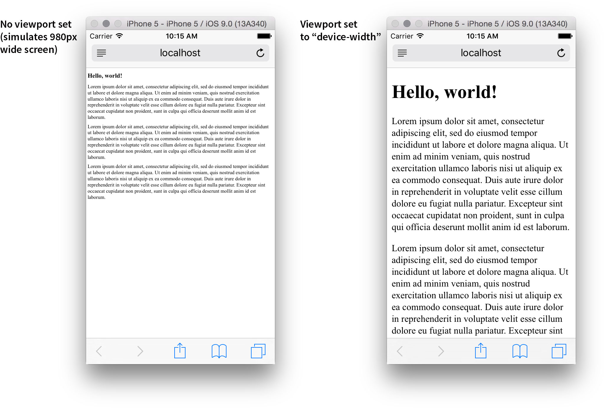
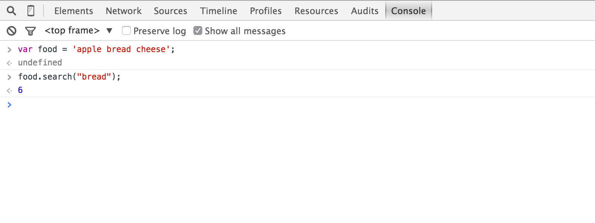
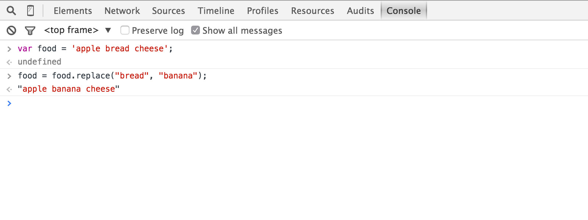

<!--

template: slideshow.php

-->

class: center, middle

# Forms + variables

---

# Overview

* HTML + CSS recap
* HTML Forms
* JavaScript + DOM recap
* String methods

---

### HTML + CSS recap

* Box sizing
* Viewport
* Media queries

---

### `box-sizing: content-box`

```
+-------------------------------------+   
|               margin                |   By default, setting the 'width'
|   +-----------------------------+   |   defines the width of the content box.
|   |           border            |   |
|   |   +---------------------+   |   |   .box {
|   |   |       padding       |   |   |       width: 70px;
|   |   |   +-------------+   |   |   |       padding: 10px;
|   |   |   |             |   |   |   |       border: 5px solid #ccc;
|   |   |   |   content   |   |   |   |       margin: 15px;
|   |   |   |             |   |   |   |   }
|   |   |   +-------------+   |   |   |
|   |   |                     |   |   |           Content:  70px
|   |   +---------------------+   |   |           Padding:  20px
|   |                             |   |   +        Border:  10px
|   +-----------------------------+   |   ----------------------
|                                     |       Visible box: 100px
+-------------------------------------+
    |       |<   width   >|       |
    |                             |
    |<        visible box        >|
```

---

### `box-sizing: border-box`

```
+-------------------------------------+   
|               margin                |   With 'box-sizing: border-box', the
|   +-----------------------------+   |   'width' sets the visible box's width.
|   |           border            |   |
|   |   +---------------------+   |   |   .box {
|   |   |       padding       |   |   |       box-sizing: border-box;
|   |   |   +-------------+   |   |   |       width: 100px;
|   |   |   |             |   |   |   |       padding: 10px;
|   |   |   |   content   |   |   |   |       border: 5px solid #ccc;
|   |   |   |             |   |   |   |       margin: 25px;
|   |   |   +-------------+   |   |   |   }
|   |   |                     |   |   |   
|   |   +---------------------+   |   |   Our box will look exactly the same,
|   |                             |   |   100px wide, but now the width property
|   +-----------------------------+   |   intuitively makes sense.
|                                     |
+-------------------------------------+
    |<           width           >|
    |                             |
    |<        visible box        >|
```

---

### Box sizing

```css
#content-box-example {
	width: 100%;
	padding: 25px;
}

#border-box-example {
	box-sizing: border-box;
	width: 100%;
	padding: 25px;
}
```

<div class="box-sizing-example">
	<strong>#content-box-example</strong>
	<div class="content">
		Lorem ipsum dolor sit amet, consectetur adipiscing elit, sed do eiusmod tempor incididunt ut labore et dolore magna aliqua. Ut enim ad minim veniam, quis nostrud exercitation ullamco laboris nisi ut aliquip ex ea commodo consequat. Duis aute irure dolor in reprehenderit in voluptate velit esse cillum dolore eu fugiat nulla pariatur. Excepteur sint occaecat cupidatat non proident, sunt in culpa qui officia deserunt mollit anim id est laborum.
	</div>
</div>
<div class="box-sizing-example border-box-example">
	<strong>#border-box-example</strong>
	<div class="content">
		Lorem ipsum dolor sit amet, consectetur adipiscing elit, sed do eiusmod tempor incididunt ut labore et dolore magna aliqua. Ut enim ad minim veniam, quis nostrud exercitation ullamco laboris nisi ut aliquip ex ea commodo consequat. Duis aute irure dolor in reprehenderit in voluptate velit esse cillum dolore eu fugiat nulla pariatur. Excepteur sint occaecat cupidatat non proident, sunt in culpa qui officia deserunt mollit anim id est laborum.
	</div>
</div>
<br class="clear">

---

### Viewport

```html
<head>
	<meta charset="utf-8">
	<meta name="viewport" content="width=device-width">
</head>
```



---

### Media queries

```css
/* Mobile */
#page {
	width: 100%;
	padding: 25px;
}

/* Tablet */
@media (min-width: 768px) {
	#page {
		width: 600px;
	}
}

/* Desktop */
@media (min-width: 1025px) {
	#page {
		padding: 150px;
		width: 900px;
	}
}
```

---

# Forms

* A way to provide information to a website
* Composed of *inputs*
* Key attribute: `action`

--

```html
<form action="page.html">
	<!-- Form inputs go here -->
</form>
```

---

# Input: text

```html
<form action="page.html">
	<input type="text" name="input1" placeholder="You can type text here">
</form>
```

<form action="/scripting/week5/forms-vars" class="border">
	<input type="text" name="input1" placeholder="You can type text here">
</form>

---

# Input: textarea

```html
<form action="page.html">
	<input type="text" name="input1" placeholder="You can type text here">
	<textarea name="input2" placeholder="You can type more text here">
	&lt;/textarea>
</form>
```

<form action="/scripting/week5/forms-vars" class="border">
	<input type="text" name="input1" placeholder="You can type text here">
	<textarea name="input2" placeholder="You can type more text here" rows="5">&lt;/textarea>
</form>

---

# Input: select

```html
<form action="page.html">
	<input type="text" name="input1" placeholder="You can type text here">
	<textarea name="input2" placeholder="You can type more text here">
	&lt;/textarea>
	<select name="input3">
		<option value="yes">Yes</option>
		<option value="no">No</option>
		<option value="maybe">Maybe</option>
	</select>
</form>
```

<form action="/scripting/week5/forms-vars" class="border">
	<input type="text" name="input1" placeholder="You can type text here">
	<textarea name="input2" placeholder="You can type more text here">&lt;/textarea>
	<select name="input3">
		<option value="yes">Yes</option>
		<option value="no">No</option>
		<option value="maybe">Maybe</option>
	</select>
</form>

---

# Input: submit

```html
<form action="page.html">
	<input type="text" name="input1" placeholder="You can type text here">
	<textarea name="input2" placeholder="You can type more text here">
	&lt;/textarea>
	<select name="input3">
		<!-- ... options ... -->
	</select>
	<input type="submit" value="Okay">
</form>
```

<form action="/scripting/week5/forms-vars" class="border">
	<input type="text" name="input1" placeholder="You can type text here">
	<textarea name="input2" placeholder="You can type more text here">&lt;/textarea>
	<select name="input3">
		<option value="yes">Yes</option>
		<option value="no">No</option>
		<option value="maybe">Maybe</option>
	</select>
	<input type="submit" value="Okay">
</form>

---

# JavaScript + DOM recap

* Hello, JavaScript
* Strings, arrays, and objects
* Document Object Model

---

### Hello, JavaScript

```html
<script>
// Log our favorite message
console.log('Hello, world!');
</script>
```

---

### Strings, arrays, and objects

```html
<script>
// Store a string, then log the string
var messageString = 'Hello, world!';
console.log(messageString);
</script>
```

```html
<script>
// This time with an array
var messageArray = ['Hello, ', 'world!'];
console.log(messageArray[0] + messageArray[1]);
</script>
```

```html
<script>
// Let's try it with an object, why not?
var messageObject = {
  first: 'Hello, ',
  second: 'world!'
};
console.log(messageObject.first + messageObject.second);
</script>
```

---

### Document Object Model

```html
<div id="hello">Hello, world!</div>
<script>
var hello = document.getElementById('hello');
// Translate the content to Spanish
hello.innerHTML = '¡Hola, mundo!';
</script>
```

---

# String search method

```js
var food = 'apple bread cheese';
food.search("bread");
```

--

.border[]

---

# String replace method

```js
var food = 'apple bread cheese';
food = food.replace("bread", "banana");
```

--

.border[]

---

# A very brief mention of regular expressions

```js
// Consider this bit of code
var food = 'apple bread cheese';
food = food.replace("e", "E");
```

__What is the result?__

--

```html
applE bread cheese
```

--

__How do we replace all “e” with “E”?__

---

# A very brief mention of regular expressions

```js
// We need to use regular expressions
var food = 'apple bread cheese';
food = food.replace(/e/g, "E");
```

__That replaces all the “e” letters__

```html
applE brEad chEEsE
```

--

* Regular expressions begin and end with `/`
* The `g` at the end is the *global flag*

---

class: what
background-image: url(images/what-html.jpg)

### New template: HTML

---

class: what
background-image: url(images/what-css.jpg)

### New template: CSS

---
