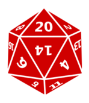

<!--

template: slideshow.php

-->

class: center, middle

# JavaScript statements

---

# Statements vs. expressions

* An __expression__ *evaluates* to produce a value  
  (e.g., `"foo" + "bar"` evaluates to `"foobar"`)
* A __statement__ is *executed* to make something happen  
  (e.g., `makeSandwich();` runs a function, itself composed of other statements)
* Statements always end with a semicolon `;`

---

# A “line” of code

* Statements can be thought of as a *line* of code
* Any program is just a sequence of statements executed one after the other
* First *do thing A*, then *do thing B*, then *thing C*, etc.
* A statement can span multiple lines of text

```js
// One "line", split across 3 lines of text
var lipsum = "Lorem ipsum dolor sit amet, consectetur adipiscing " +
             "elit, sed do eiusmod tempor incididunt ut labore et " +
             "dolore magna aliqua.";
```

---

### Q: How do you make a peanut butter and jelly sandwich?


.footnote[Image credit: [Wikipedia](https://en.wikipedia.org/wiki/Peanut_butter_and_jelly_sandwich)]

---

# Blocks

* A group of statements is called a __block__
* Enclosed by curly braces `{ ... }`, a block is itself treated as a statement
* Blocks are used by many things: conditionals, loops, functions
* Variable scoping: blocks do *not* have private variables

--

```js
var chicken = "bok bok bok";
if (coopIsOpen) {
	// This is a block, but it scopes to the same variables as its parent
	chicken = "ro-uh-ro-uh-roooo";
	chicken = chicken.replace(/o/g, 'O');
	chicken = chicken + " ... bok bok bok";
}
```

---

## Curly braces + semicolons, *use ’em!*

* Technically you are allowed to omit curly braces, if your block has just one line
* JavaScript is also forgiving about missing semicolons
* It is good practice to always use them even though they are optional

--

```js
// This works, technically
while (panda.awake())		// No curly braces!
	panda.eatBamboo()		// No semicolon!

// But this version is better
while (panda.awake()) {
	panda.eatBamboo();
}
```

---

# `var` statements

* Declare one or more more variables (comma-separated)
* Optionally assign an initial value
* Always declare your variables, even though it’s optional
* Good practice to place `var` declarations at the *top* of your statement block

```js
var goat,              // No value, goat is "undefined"
    sheep = 'sam',     // sheep is assigned a string value
    animalCount = 47;  // animalCount is assigned a number
```

---

# Conditionals

* Conditionals allow you to make decisions within code
* Selectively execute particular statements and not others

```js
// Depending on animalCount, only one statement will be called
if (animalCount < 5) {
	animalCount += getMoreAnimals();
} else if (animalCount > 10) {
	animalCount -= sellAnimals();
} else {
	tendToAnimals();
}
```

---

# Loops

* Run a block of statements repeatedly
* Exit the loop under certain conditions

--

```js
// This is a 'while' loop
var numberOfCats = 0;
while (numberOfCats < 15) {
	adoptCatFromShelter();
	numberOfCats++;
}
```

--

```js
// This is an equivalent 'for' loop
for (var i = 0; i < 15; i++) {
	adoptCatFromShelter();
}
```

---

name: functions

# Functions

* A *named* block of statements
* Can be called by writing the function name, followed by parentheses `functionName();`
* Can optionally return a value

--

```js
// First we declare the function
function d20() {
	// Buncha statements that simulate a d20 die
	var random = Math.random() * 20;
	random = Math.round(random); // (don't include decimals)
	return random;
}

// Then we execute the function
var roll = d20();  // roll has a random number from 1 to 20
```

.d20[]

---

# Passing arguments

* Functions can accept variables called *arguments*
* These are variables that get assigned at execution time

```js

function die(sides) {
	// Simulate an arbitrary sized die
	var random = Math.random() * sides;
	random = Math.round(random); // (don't include decimals)
	return random;
}

var roll1 = die(20);   // Random number from 1-20
var roll2 = die(100);  //               from 1-100
var roll3 = die(4);    //               from 1-4
```

---

layout: true

# Callbacks

* You can assign a function to a variable
* A *callback* is a function that you pass for later execution

---

```js
// We are assigning a function value to variable logMessage
var logMessage = function(messageToLog) {
	console.log(messageToLog);
};
```

---

```js
// We are assigning a function value to variable logMessage
var logMessage = function(messageToLog) {
	console.log(messageToLog);
};

// This function does something, then executes a callback
function doTheThing(theCallback) {
	
	// Buncha statements that do the thing...
	
	theCallback(); // ... then when we're done, execute theCallback
}
```

---

```js
// We are assigning a function value to variable logMessage
var logMessage = function(messageToLog) {
	console.log(messageToLog);
};

// This function does something, then executes a callback
function doTheThing(theCallback) {
	
	// Buncha statements that do the thing...
	
	theCallback(); // ... then when we're done, execute theCallback
}

// First we doTheThing, then logMessage
doTheThing(logMessage);
```

---

layout: false

# Event handlers

* Callbacks that get executed by the browser when an event fires
* Do something on *click*, *mouse move*, when the page *scrolls*, etc.

```js
var page = document.body;

var turnPageRed = function() {
	page.style.backgroundColor = '#FF0000';
	document.title = 'Red page!';
};

// Click on the page, and it will turn red
page.onclick = turnPageRed;
```

---

# Event handlers

* Callbacks that get executed by the browser when an event fires
* Do something on *click*, *mouse move*, when the page *scrolls*, etc.

```js
var page = document.body;

var turnPageRed = function() {
	page.style.backgroundColor = '#FF0000';
	document.title = 'Red page!';
};

// This is the better DOM-style of setting up event handlers
page.addEventListener('click', turnPageRed, false);
```

---

# Types of event handlers

* Page: `load`, `unload`, `DOMContentLoaded`
* Mouse: `click`, `mousedown`, `mouseup`, `mousemove`, `mouseover`, `mouseout`
* Keyboard: `keypress`, `keydown`, `keyup`
* Form: `submit`
* Form input: `change`, `focus`, `blur`

.footnote[There are [many many events](https://developer.mozilla.org/en-US/docs/Web/Events)!]
