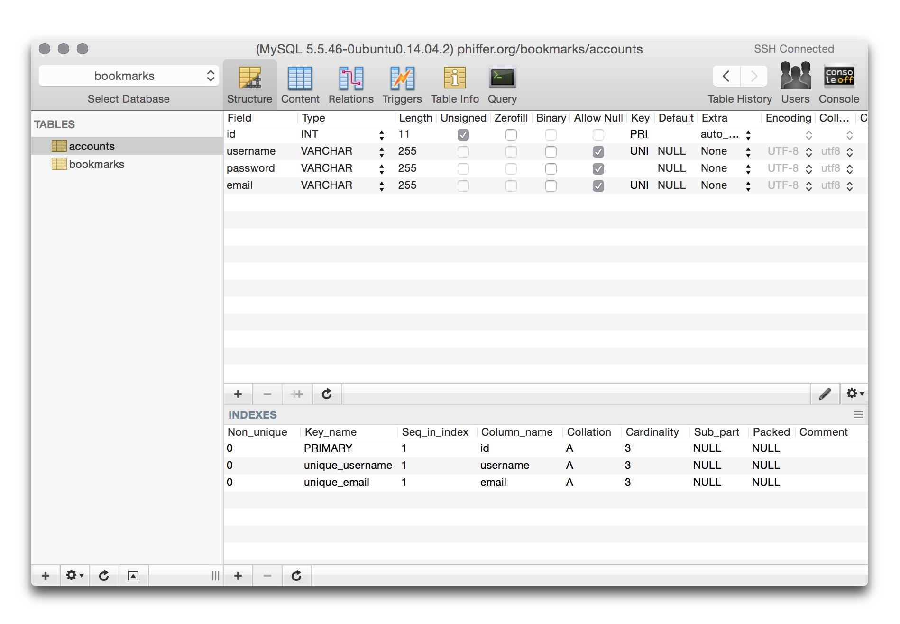
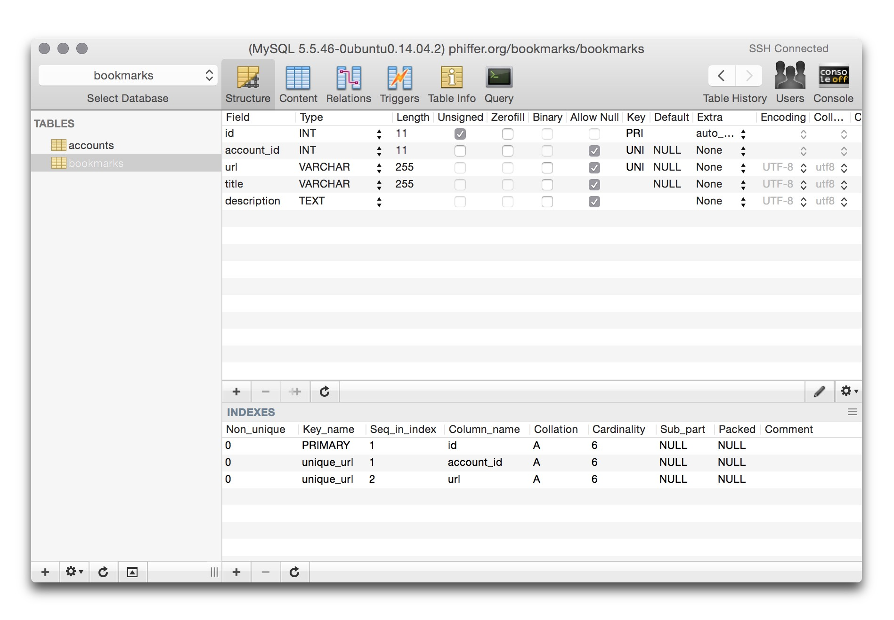
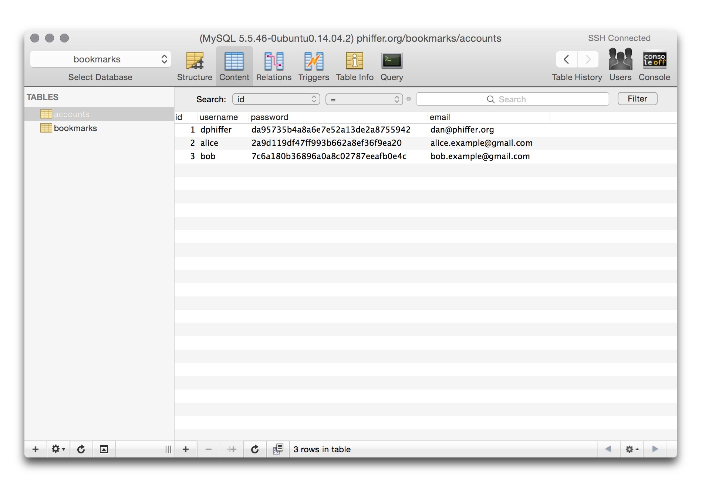
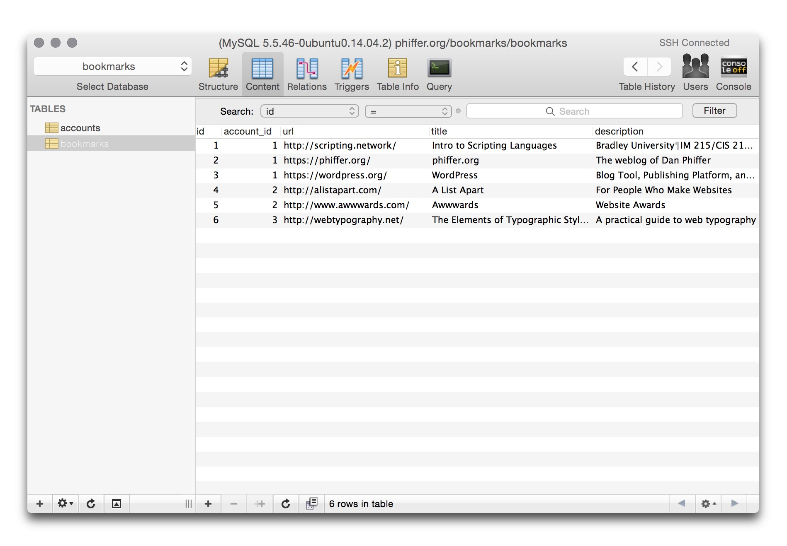
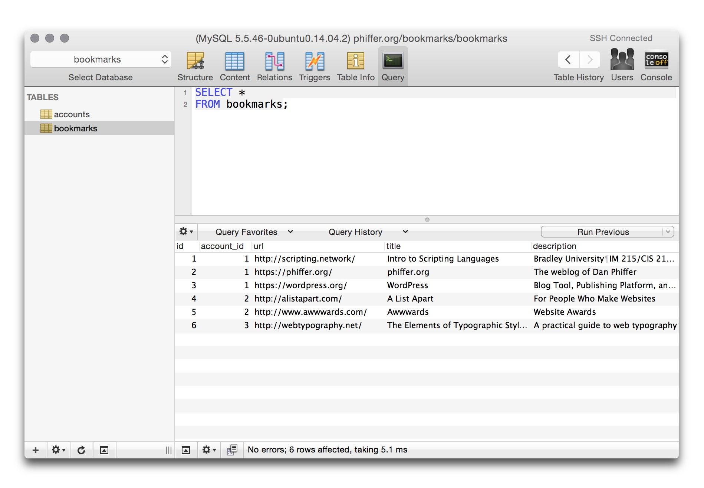
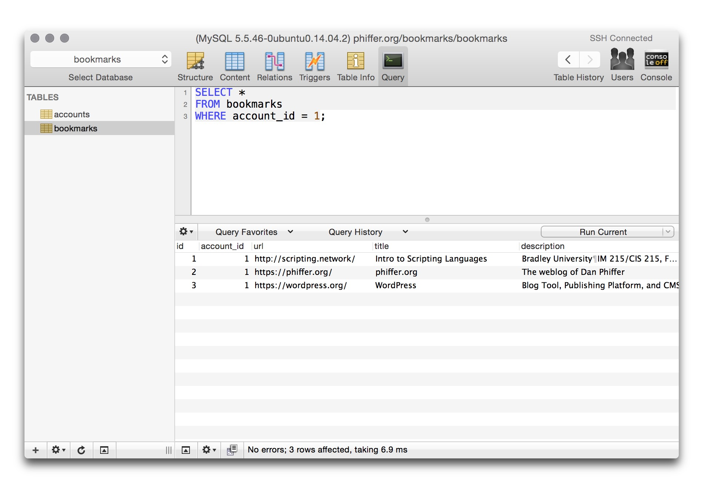
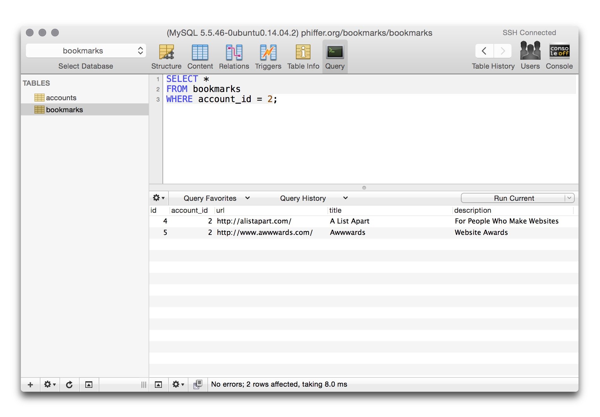
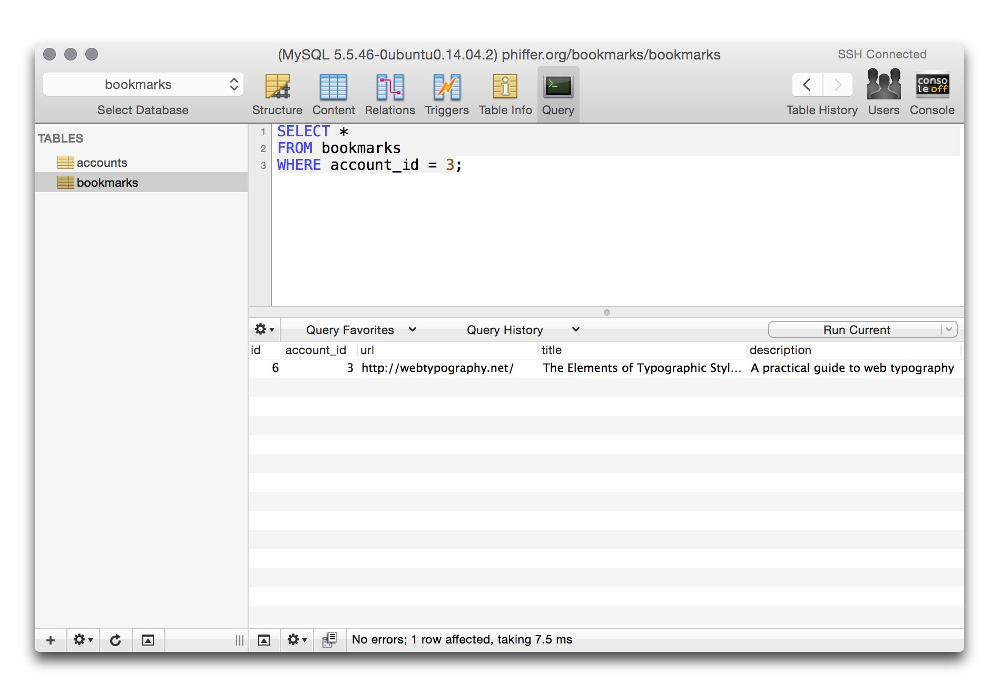

<!--

template: slideshow.php

-->

class: center, middle

# Relational Databases

---

# Quick review

* Data structures
* PHP Data Objects (PDO)
* INSERT/SELECT/UPDATE/DELETE
* Simple login

---

layout: true
### Quick review

---

# Data structures

```php
<?php

$number = 1.618;
$string = "Golden ratio: $number";

$array = array('apple', 'banana', 'cantaloupe');
$melon = $array[2];

$assoc = array(
	'Moby Dick'        => 'Herman Melville',
	'Frankenstein'     => 'Mary Shelley',
	'The Time Machine' => 'H. G. Wells'
);
$american_novelist = $assoc['Moby Dick'];

?>
```

---

# PHP Data Objects (PDO)

```php
<?php

$username = 'bookmarks';
$password = 'kdN3l1.491';

$dsn = 'mysql:host=127.0.0.1;dbname=bookmarks';
$db  = new PDO($dsn, $username, $password);

$query = $db->query("
	SELECT *
	FROM accounts
");
$accounts = $query->fetchAll();

?>
```

---

# INSERT/SELECT/UPDATE/DELETE

```sql
INSERT INTO accounts
(username, email, password)
VALUES ('dphiffer', 'dan@phiffer.org', 'dNn1le.193');

SELECT id, username, email
FROM accounts
WHERE username = 'dphiffer'
  AND password = 'dNn1le.193';

UPDATE accounts
SET password = 'snll119/884'
WHERE username = 'dphiffer';

DELETE FROM accounts
WHERE username = 'dphiffer';
```

---

# Simple login

```php
<?php

<form action="login.php" method="post">
	<input type="text" name="username">
	<input type="password" name="password">
	<input type="submit" value="Login">
</form>
<?php

$logged_in = false;
if (!empty($_POST['username']) &&
    !empty($_POST['password']) &&
    !empty($valid_users[$username]) &&
    $valid_users[$username] == $password]) {
	$logged_in = true;
}

?>
```

---

layout: false

## Table structure: accounts



---

## Table structure: bookmarks



---

## Table content: accounts



---

## Table content: bookmarks



---

## Query: all bookmarks



---

## Query: my bookmarks



---

## Query: Alice’s bookmarks



---

## Query: Bob’s bookmarks



---

## User registration

```php
<?php

function register_user($username, $password, $email) {
	global $db;
	$query = $db->prepare("
		INSERT INTO accounts
		(username, password, email)
		VALUES (?, ?, ?)
	");
	$query->execute(array(
		$username,
		$password,
		$email
	));
}

?>
```

---

## Hash the password!

```php
<?php

function register_user($username, $password, $email) {
	global $db;
	
	// Don’t store the raw password in the database
	$password = md5($password);
	
	$query = $db->prepare("
		INSERT INTO accounts
		(username, password, email)
		VALUES (?, ?, ?)
	");
	$query->execute(array(
		$username,
		$password,
		$email
	));
}

?>
```
