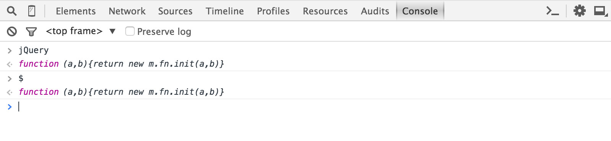

# Exercise: The Whale

This week we will explore how AJAX can be used to bring new content onto the page dynamically. We'll also be using jQuery for the first time.

## Create a new repository

* Go to [github.com/new](https://github.com/new) and create a repository called `exercise-4-whale`
* Use the __GitHub Desktop__ app to clone the repository on your local computer

## Start with blank files

* Open the cloned folder in the __Atom__ editor
* Create three files: `index.html`, `whale.css`, and `whale.js`
* Commit + sync the empty files to GitHub as your first commit

## Add the repository to the course website

* [Login](/scripting/lib/login.php) to the course website with GitHub
* Once the OAuth process takes you back to the course website, click the checkbox next to __exercise-4-whale__

After a moment, the repository name should turn into a clickable link. Each time you push changes to GitHub, the course website should download the changes for testing. For now you should see a blank page.

## HTML with external CSS + JS

* Copy/paste this basic template to `index.html`

```html
<!DOCTYPE html>
<html>
	<head>
		<meta charset="utf-8">
		<title>The Whale</title>
		<link rel="stylesheet" href="whale.css">
	</head>
	<body>
		<script src="whale.js"></script>
	</body>
</html>
```

* Commit and sync your changes to GitHub

If all goes well, the page linked __exercise-4-whale__ on the course website should reflect your newly pushed changes. Your blank page should now have a title in the browser tab: “The Whale.”

## Add jQuery to the mix

* Go to [jquery.com](https://jquery.com/)
* Click the big orange __Download jQuery__ button
* Right click on the link that says “Download the compressed, production jQuery 1.11.3” and choose __Save Link As__ and save the file `jquery-1.11.3.min.js` to your project folder
* Add the following script tag *before* the line `<script src="whale.js"></script>`

```js
<script src="jquery-1.11.3.min.js"></script>
```

* Commit and sync your changes to GitHub

Reload the test page on the course website. It should still be blank, but you can open the JavaScript console and type `jQuery` or `$` and confirm that the jQuery library is now included.

{.border}

## Add a link to the page

* Add the following placeholder link to the top of the `<body>` element

```html
<a href="#hello">hello</a>
```

* Let's also add a CSS style to `whale.css`

```css
body {
	font: bold 120px helvetica, sans-serif;
	letter-spacing: 1px;
	text-transform: uppercase;
}
```

* And, as before, commit and sync your changes to GitHub

Now we have something to look at!

{.border}

## Are you .ready() for some jQuery?

* Add the following to `whale.js` to kick off your JS (this part is worth typing out, try to avoid copy/paste from here on out)

```js
jQuery(document).ready(function($) {
	
});
```

* Inside your `.ready()` function (i.e., between `{` and `}`), add the following log statement

```js
console.log(location.hash)
```

* Commit and sync your changes to GitHub

Now if you reload the page, you should see an empty string `""` logged to the JavaScript console. If you click on the link, the URL will change so that it ends with `#hello` (but the page won't reload, changing the “# part” of a URL leaves the page as-is). If you reload the page again, you'll see `"#hello"` logged to the JavaScript console instead of an empty string.

## Parse the hash

* Replace the `console.log` line with the following lines

```js
var num = location.hash.substr(1);
console.log(num);
```

The `substr(1)` method will strip off the `#` prefix from the `location.hash` value.

* Modify the first line slightly, to parse the value into a number

```js
var num = parseInt(location.hash.substr(1));
```

* Commit and sync your changes to GitHub

You should be able to reload the page and see `NaN` logged to the JavaScript console. However, if you modify the URL so that it ends with a number—say `#0` or `#35`—and reload the page, you should see that number logged to the JavaScript console.

## Check for a valid numeric value

* Add the following conditional to your JavaScript, after the `var num =` line and the `console.log` line

```js
if (isNaN(num)) {
	num = 0;
}
```

* Commit and sync your changes to GitHub

Reloading your page, you should now see a number logged to the JavaScript console regardless of what the URL hash is set to. If the hash *is* actually a number, that number should be logged. In all other cases a zero should be logged.

## Load text with AJAX

* Add the following JavaScript after the console.log line (remember, no copy/pasting!)

```js
$.get('/whale/txt/' + num + '.txt', function(txt)) {
	console.log(txt);
});
```

* Commit and sync your changes to GitHub

Note that at this point the JavaScript won’t work properly if you open `index.html` from your browser. You’ll need to test from the course website, due to how AJAX works.

At this point you should see “MOBY DICK; OR THE WHALE” logged to your JavaScript console. You loaded it from AJAX! (Note: the 23k .txt files are hosted at [phiffer.org/whale](http://phiffer.org/whale/), which is where the AJAX request is pulling the file 0.txt from).

## Update the link

* Replace the `console.log(txt)` line, inside the AJAX callback, with the following jQuery commands

```js
$('a').html(txt);
$('a').attr('href', '#' + (num + 1));
```

* Commit and sync your changes to GitHub

Now when you reload your page you should see the link “hello” replaced with “MOBY DICK; OR THE WHALE”.

* Let’s tweak index.html slightly to avoid the flash of “hello” before the AJAX request loads

```html
<a href="#"></a>
```

{.border}

## Wrap the code in a function

We are very close! We can change the URL to include `#12`, reload it, and get the 13th text file, but we still haven’t quite made it respond to mouse clicks. The final step in getting this is to harness an event called “onhashchange.”

* Take everything inside the `.ready()` callback function and wrap it in a function called update

```js
jQuery(document).ready(function($) {
	function update() {
		/* All your other code goes here */
	}
});
```

* Call the update function, and *also* assign it to be the “onhashchange” listener

```js
function update() {
	/* ... */
}
update();
window.addEventListener('hashchange', update, false);
```

You may be wondering why we didn’t use a more jQuery-style event listener, perhaps `$(window).hashChange`? The `onhashchange` event just isn’t part of jQuery core, but you could add support [as a plugin](http://benalman.com/projects/jquery-hashchange-plugin/).

* Commit and sync your code to GitHub

Now if you click on the link, the text should advance. And because of the `#`-style URL, you can send any given position in the text as a permalink. You now have a working single-serving Moby Dick site!
