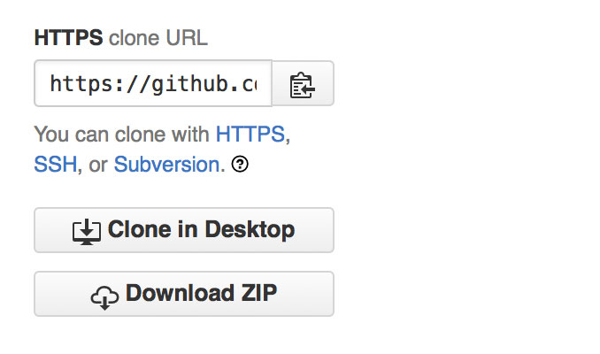

# Exercise: *Tiniest Wiki*

Up until now we've only been working on the front-end side of the web. Now let's dig into how the server-side looks.

## Create a new repository

* Go to [github.com/new](https://github.com/new) and create a repository called __exercise-5-wiki__
* Use the __GitHub Desktop__ app to clone the repository on your local computer

## Start with a blank file

* Open the cloned folder in the __Atom__ editor
* Create one empty file: `index.php`
* Commit + sync the empty file to GitHub as your first commit

## Copy the repository URL

* Go to the repository you just created on GitHub
* Look for __HTTPS clone URL__ box in the right hand sidebar
* Copy that URL to your clipboard

{.border}

## Clone the repository

* Open your command-line terminal application
* Login to the course server:  
  `ssh username@scripting.network`  
  (Note: you should replace *username* with your username)
* Clone the repository you just made, pasting the clone URL in the command:  
  `git clone [HTTPS clone URL] www`  
  (Note: you should replace *[HTTPS clone URL]* with the URL you just copied.)
* Look inside the repository you just cloned:

```
cd www
ls
```

You should see your empty file, index.php, listed.

## Echo the query string

* Go back to Atom editor and add the following to your empty index.php

```php
<?php

$input = $_GET['input'];
echo $input;

?>
```

* Commit your changes and sync to GitHub

## Updating your cloned repository

* Go back to your SSH session in the terminal
* Type in: `git pull origin master`
* Confirm that your changes got downloaded: `cat index.php`

You should see the new PHP code you just committed.

## Test out your very basic wiki

* Try going to the URL:  
  http://scripting.network/username/

You should see a blank page.

* Now try adding an input variable to the URL:   
  http://scripting.network/username/?input=Hello

You should see a blank page with the word “Hello” printed.

That’s all for now!
